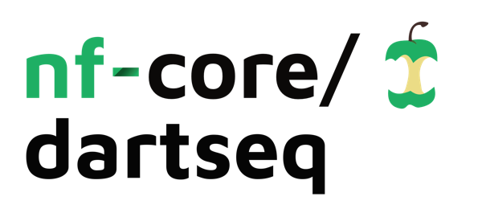
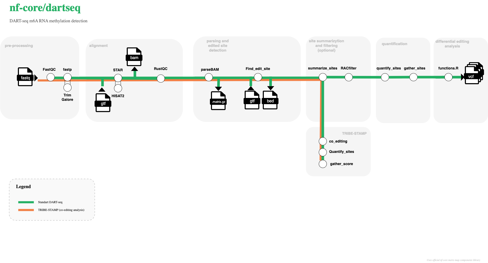

<h1>
  <picture>
    <source media="(prefers-color-scheme: dark)" srcset="docs/images/nf-core-dartseq_logo_dark.png">
    
  </picture>
</h1>

[](https://github.com/codespaces/new/nf-core/dartseq)
[](https://github.com/nf-core/dartseq/actions/workflows/nf-test.yml)
[](https://github.com/nf-core/dartseq/actions/workflows/linting.yml)[](https://nf-co.re/dartseq/results)
[](https://www.nf-test.com)

[](https://www.nextflow.io/)
[](https://github.com/nf-core/tools/releases/tag/3.5.2)
[](https://doi.org/10.5281/zenodo.XXXXXXX)
[](https://docs.conda.io/en/latest/)
[](https://www.docker.com/)
[](https://sylabs.io/docs/)
[](https://cloud.seqera.io/launch?pipeline=https://github.com/nf-core/dartseq)

[](https://nfcore.slack.com/channels/dartseq)[](https://bsky.app/profile/nf-co.re)[](https://mstdn.science/@nf_core)[](https://www.youtube.com/c/nf-core)

## Introduction

**nf-core/dartseq** is a bioinformatics pipeline that ...

**nf-core/dartseq** is a workflow for DART-seq style RNA sequencing analyses with optional RNA editing downstream steps.
It accepts single-end or paired-end FASTQ input, performs read QC and alignment, and can run Bullseye- and RustQC-based
post-processing. Standard outputs include per-sample QC reports, alignments, MultiQC summaries, and optional edited-site tables.



Default pipeline steps:

1. Adapter and quality trimming (`fastp` or `Trim Galore`)
2. Read QC reporting with [FastQC](https://www.bioinformatics.babraham.ac.uk/projects/fastqc/)
3. Alignment with STAR or HISAT2
4. Optional Bullseye site parsing, quantification, and filtering
5. Optional RustQC summaries
6. Aggregated reporting with [MultiQC](http://multiqc.info/)

## Usage

> [!NOTE]
> If you are new to Nextflow and nf-core, please refer to [this page](https://nf-co.re/docs/usage/installation) on how to set-up Nextflow. Make sure to [test your setup](https://nf-co.re/docs/usage/introduction#how-to-run-a-pipeline) with `-profile test` before running the workflow on actual data.

Prepare a samplesheet with at least `sample`, `fastq_1`, and `fastq_2` columns.
For single-end data, leave `fastq_2` empty.

Now, you can run the pipeline using:

```bash
nextflow run nf-core/dartseq \
   -profile <docker/singularity/.../institute> \
   --input samplesheet.csv \
   --outdir <OUTDIR>
```

> [!WARNING]
> Please provide pipeline parameters via the CLI or Nextflow `-params-file` option. Custom config files including those provided by the `-c` Nextflow option can be used to provide any configuration _**except for parameters**_; see [docs](https://nf-co.re/docs/usage/getting_started/configuration#custom-configuration-files).

For more details and further functionality, please refer to the [usage documentation](https://nf-co.re/dartseq/usage) and the [parameter documentation](https://nf-co.re/dartseq/parameters).

## Pipeline output

To see the results of an example test run with a full size dataset refer to the [results](https://nf-co.re/dartseq/results) tab on the nf-core website pipeline page.
For more details about the output files and reports, please refer to the
[output documentation](https://nf-co.re/dartseq/output).

## Credits

nf-core/dartseq was originally written by Mathieu Flamand, Olga Brovkina, Joana Pimenta Bernardes, Fatemeh Nasehi.

We thank the following people for their extensive assistance in the development of this pipeline:

- The nf-core maintainers and community contributors who helped evolve the template integration and testing strategy.

## Contributions and Support

If you would like to contribute to this pipeline, please see the [contributing guidelines](.github/CONTRIBUTING.md).

For further information or help, don't hesitate to get in touch on the [Slack `#dartseq` channel](https://nfcore.slack.com/channels/dartseq) (you can join with [this invite](https://nf-co.re/join/slack)).

## Citations

If this pipeline is used in a publication, cite the nf-core framework below and the software references in `CITATIONS.md`.
After the first release, update the placeholder DOI `10.5281/zenodo.XXXXXXX` in this README with the pipeline Zenodo DOI.

An extensive list of references for the tools used by the pipeline can be found in the [`CITATIONS.md`](CITATIONS.md) file.

You can cite the `nf-core` publication as follows:

> **The nf-core framework for community-curated bioinformatics pipelines.**
>
> Philip Ewels, Alexander Peltzer, Sven Fillinger, Harshil Patel, Johannes Alneberg, Andreas Wilm, Maxime Ulysse Garcia, Paolo Di Tommaso & Sven Nahnsen.
>
> _Nat Biotechnol._ 2020 Feb 13. doi: [10.1038/s41587-020-0439-x](https://dx.doi.org/10.1038/s41587-020-0439-x).
